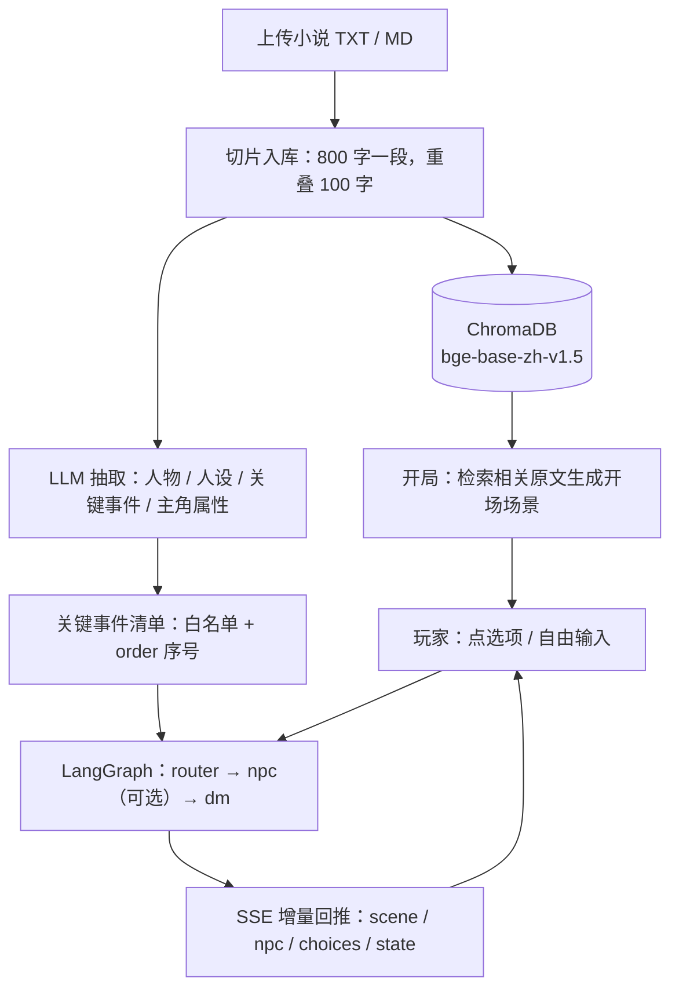
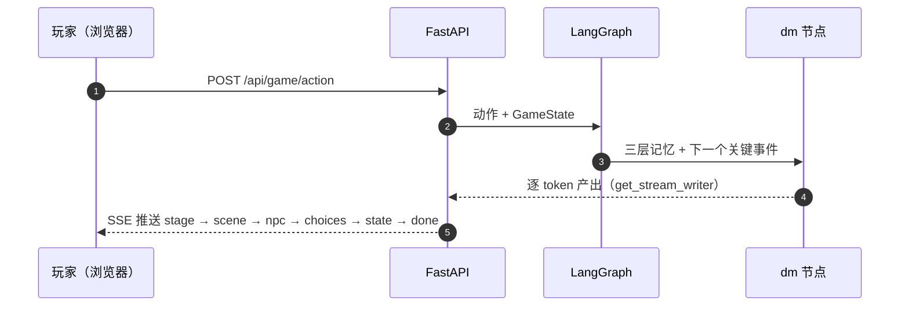
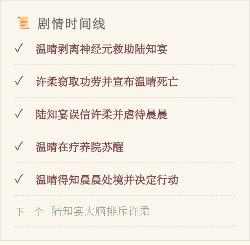
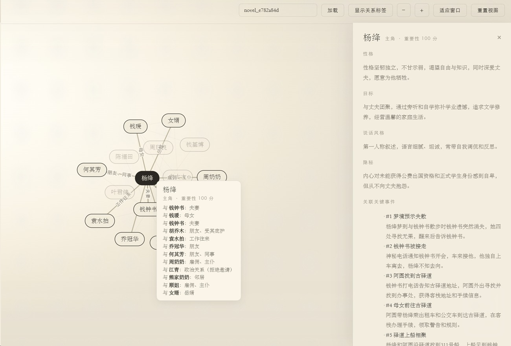
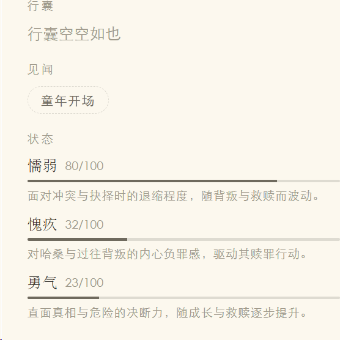
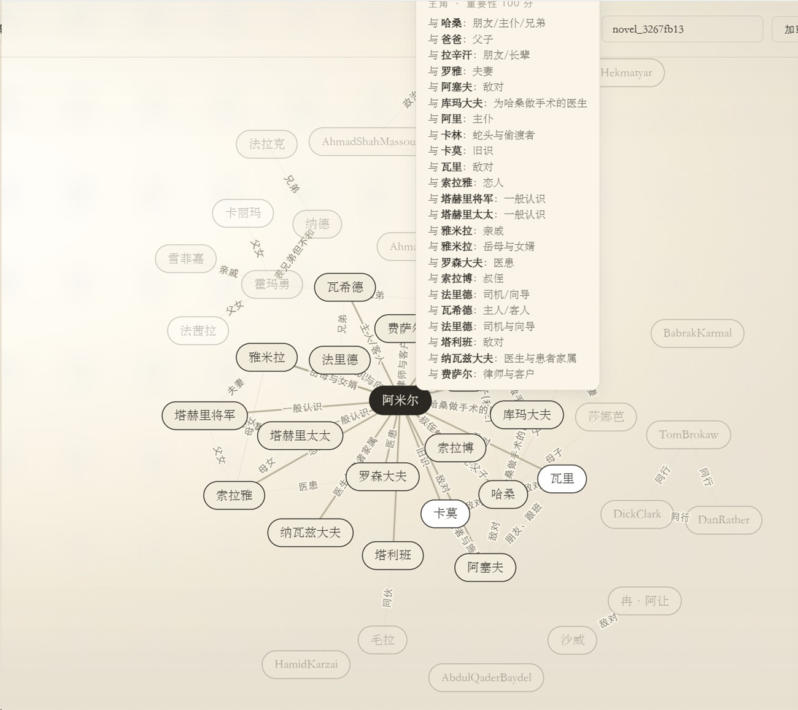
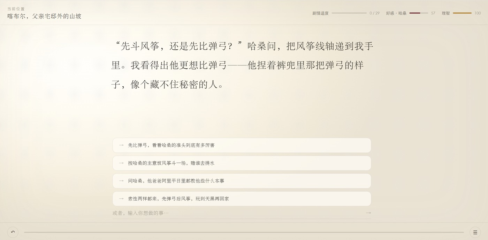
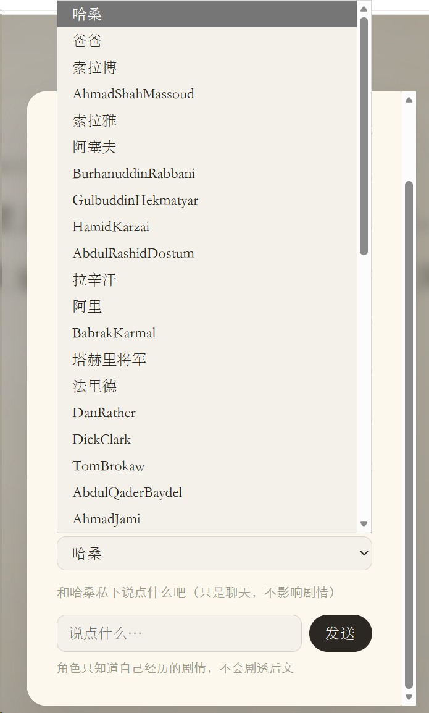
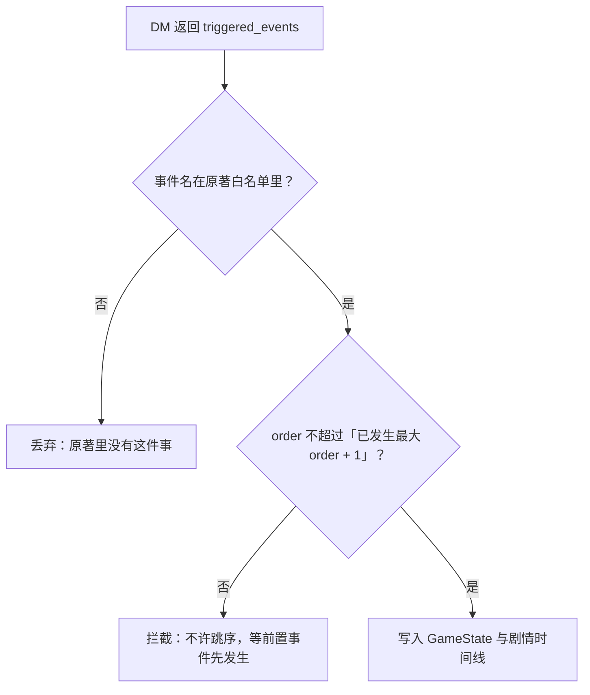
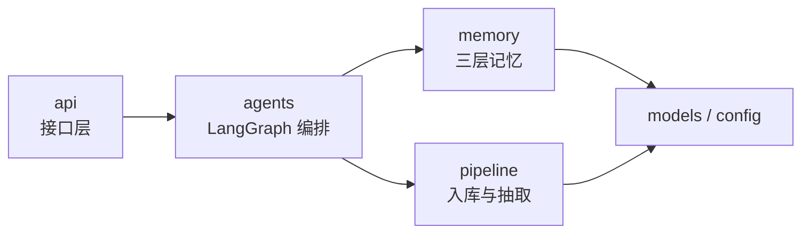

<div align="center">

# 阅界 · 小说互动游戏引擎

**把一本小说变成可玩的文字冒险游戏**

##### 陈效彤 

*AI 在**原著框架内**实时推演 —— 不剧透后文，也不编原著里没有的剧情*


<br>


<sub>书架：上传素材 · 继续上次游戏 · 示例作品库 · 设置</sub>

</div>

**English**: An engine that turns a novel into a playable text adventure, powered by a three-layer RAG memory pipeline and a LangGraph multi-agent orchestrator. FastAPI + SSE backend, dependency-free vanilla-JS front end.

**作者**：[@lkatybb](https://github.com/lkatybb)

---

## 30 秒看懂

上传一本 TXT / MD 小说 → 按段落切片、向量化入库 → 生成开场场景 → 玩家输入动作 → AI 流式推演剧情、给出选项、更新角色状态。

关键区别：不是"让 LLM 随便编故事"，而是让 LLM 在**原著切片** + **已发生的关键事件** + **玩家当前状态**三重约束下推演。

| 你给什么 | 系统做什么 | 你得到什么 |
|---|---|---|
| 一本 TXT / MD 小说 | 切片入库（800 字一段、重叠 100 字）+ LLM 抽取人物关系 / NPC 人设 / 关键事件 / 主角属性 | 一个能玩的文字冒险 |
| 一句话动作，或点一个选项 | 三层记忆检索 + 关键事件两道闸门 + 多 Agent 推演 | 流式剧情、选项、状态变更 |
| 「和某个角色私下聊两句」 | 只读旁路：只给它「已经发生」的信息 | 不推进剧情的一段对话 |

---
## 在线试玩：http://134.175.149.21:8000/

## 它是怎么跑起来的



一轮完整的「讲故事」回合，时序是这样：



---

## 上手长什么样

<p align="center">
  
  <br>
  <sub>一轮之后：顶部是位置 · 剧情进度 18/29 · 焦点角色好感与理智度；正文下方 4 个选项，最底下永远留着「或者，输入你想做的事」</sub>
</p>

<p align="center">
  
  
  <br>
  <sub>左：剧情时间线 —— 只列「已经发生」，灰字标出「下一个」 · 右：角色私聊 —— 面板上写着「角色只知道自己的剧情，不会剧透后文」</sub>
</p>

<p align="center">
  
  
  <br>
  <sub>左：角色百科（性格 / 目标 / 说话风格 / 隐秘 + 关联关键事件 + 原著片段，点关系图节点弹出） · 右：行囊见闻 → 状态（这本书的三项是懦弱 / 愧疚 / 勇气）</sub>
</p>

<p align="center">
  
  <br>
  <sub>人物关系力导图：D3.js 单文件实现，数据来自 <code>GET /api/novel/{novel_id}/graph</code></sub>
</p>

### 三种输入，三种反应

| 你输入 | Router 判定 | 实际发生 |
|---|---|---|
| 「我向旁边的人打听一下路」 | `dialog`，但没指名具体角色 | 条件边直连 `dm`，省掉一次 `npc` 调用 |
| 输入里出现了**主角的名字** | `dialog`，且指名了对话目标 | **主角例外**：`is_protagonist` 拦掉 `npc` 分支（放行的话 NPC 会反过来替玩家演出自己），交回 `dm` 正常叙述 |
| 「我要直接去最后那个地方」 | `action`，DM 声明了靠后的事件 | **顺序闸门**拦截跳序（只放行 `order <= 当前最大 order + 1`），剧情照原著节奏推进一格 |
| 「和某个角色私下聊两句」 | 独立端点 `POST /api/game/chat` | 只读旁路：不写状态、不落盘，私聊前后存档字节不变 |

### 更多界面（点开）

<details>
<summary>开场首屏 · 角色私聊全屏</summary>

<p align="center">
  
  <br>
  <sub>开场：剧情进度 0/29，时间线上还什么都没有</sub>
</p>

<p align="center">
  
  <br>
  <sub>私聊全屏版：整段对话滚到底，剧情与状态一动不动</sub>
</p>

</details>

---

## 核心设计

### 1. 三层 RAG 记忆

| 层 | 存储 | 作用 | 实现 |
|---|---|---|---|
| 短期 | 内存 `deque(maxlen=5)` | 最近 5 轮对话，保证走位连贯 | [`memory/short_term.py`](novel_game/memory/short_term.py) |
| 长期 | ChromaDB + `bge-base-zh-v1.5` | 按玩家动作**语义检索**最相关的原著段落 | [`memory/long_term.py`](novel_game/memory/long_term.py) |
| 全局 | 内存 `GameState` | 位置 / 物品 / flag / 状态值 / 已触发事件 | [`memory/global_state.py`](novel_game/memory/global_state.py) |

- 短期记忆用 `deque` 而非 list，溢出自动淘汰，不需要手动裁剪。
- 长期记忆用**余弦距离**检索 top-5（`RETRIEVAL_TOP_K`），结果拼成 `[原著片段N]` 注入 Prompt。
- 检索失败时返回空列表并记日志，不阻断本轮推演（[`long_term.py`](novel_game/memory/long_term.py) 的 `retrieve`）。
- **会话脉络**（[`memory/session_memory.py`](novel_game/memory/session_memory.py)）：短期记忆窗口只有 5 轮，再往前的历史会整段丢失，AI 到后期就忘了第 1 章做过什么。每轮结束后把该轮的「玩家动作 + 剧情摘录 + 本轮触发的关键事件」压成一条关键节点落盘到 `data/session_memory/`，组装 Prompt 时补在 `[短期记忆]` 之后，**只补已滑出窗口的轮次**，同一轮不会重复出现。有界性：滑出窗口的轮次最多注入 `EARLY_NODE_LIMIT`（10）条，更早的只保留触发过关键事件的节点 —— 普通对话随剧情淡出，主线关键节点永久保留。

### 2. 关键事件硬锁

这是项目里最"较真"的一环 —— 防止 LLM 提前剧透、或编造原著里没有的剧情。

小说入库时用 LLM 抽取**关键事件清单**（每条带 `order` 序号）。之后 DM 返回的 `triggered_events` 要过两道闸门才能写进状态：

1. **白名单**：事件名必须在原著预设清单内，LLM 编的名字直接丢弃
2. **顺序闸门**：只能触发 `order <= 当前最大 order + 1` 的事件，不允许跳序

取不到事件清单时放行，避免误杀。实现在 [`global_state.py`](novel_game/memory/global_state.py) 的 `_accept_triggered`。



**开场对齐（唯一例外）**：开场那一次要把**完整**清单（只有 `order` + 事件名，不含 `trigger_condition`）交给 DM（`agents/dm.py` 的 `build_opening_prompt`），否则它不知道开场落在原著哪一刻，不敢声明任何事件 —— 时间线会永远冻在 `order` 最小的那件事上。DM 声明"开场时点之前已发生"的事件后，被顺序闸门拦掉的前置事件由 `seed_past_events` 按"关键事件线性发生"补记（能声明第 k 件 ⇒ 第 1..k 件必然都发生过）。**该清单只在开场出现一次**，动作轮仍只注入 `[下一个必须发生的关键事件]`。

**对外只暴露「已发生」和「下一个」**：`state` 帧下发 `triggered`（已触发事件名数组）、`next_event`（仅 `event_name` + `order`，无未触发事件时为 `null`）、`total`，前端据此渲染「✓ 已触发」+「灰·下一个」两类；未触发事件的全清单与 `trigger_condition` **一律不下发**。DM Prompt 也只注入**当前待触发的这一个**事件（`memory/global_state.py` 的 `get_next_event`）—— 一次性把未触发清单塞进 Prompt，等于把后文剧情提前交给模型。

### 3. LangGraph 多 Agent 编排

```
START ──► router ──┬── dialog 且指名「非主角」NPC ──► npc ──► dm ──► END
                   └── 其它 ─────────────────────────► dm ──► END
```

| 节点 | 职责 | 代码 |
|---|---|---|
| `router` | 判断动作类型（`dialog` / `action` / `off_rail`）+ 识别对话目标 | [`agents/router.py`](novel_game/agents/router.py) |
| `npc` | 按人设档案生成 NPC 台词 | [`agents/npc.py`](novel_game/agents/npc.py) |
| `dm` | 主推演：结合三层记忆产出剧情正文 + 选项 + 状态变更 | [`agents/dm.py`](novel_game/agents/dm.py) |

两个设计取舍：

- **没有独立的 Rules 节点。** 初版架构里 Router 和 Rules 是两个节点，实测多一次 LLM 往返延迟明显，合并进 Router 的判定结果（见 [`PRD.md`](PRD.md) 第 8 节风险表）。
- **条件边省一次调用。** 只有"对话类且指名了 NPC"才绕道 `npc` 节点，其余动作直连 `dm`。**主角例外**：玩家扮演的就是主角本人，Router 会把正文里的名字当成对话目标回填（图里是「孙悟空」，它会回「悟空」），放行后 `npc` 节点会反过来替玩家演出。条件边用 `pipeline/character_extractor.is_protagonist` 拦掉主角，交回 `dm` 正常叙述；`npc.chat` 的私聊入口也拒绝主角本人。

**流式与图不冲突**：`dm` 节点内部用 `get_stream_writer()` 把 LLM 逐 token 的产出实时推出图外，所以走 StateGraph 不会牺牲打字机效果。CLI 和 Web 共用同一张图，行为一致（公开入口 `stream_graph` / `run_graph`）。

### 4. SSE 事件协议

`POST /api/game/action` 返回 `text/event-stream`，事件类型：

| `type` | 载荷 | 用途 |
|---|---|---|
| `stage` | `text` | 进度提示（"正在理解你的行动…"） |
| `scene_change` | `name`, `desc` | 场景切换弹窗（同名场景不弹） |
| `scene` | `text` | 剧情正文，**逐块增量**送达 |
| `npc` | `speaker`, `text` | NPC 台词 |
| `choices` | `options` | 本轮选项 |
| `state` | `state` | 完整角色状态 + `_timeline` 时间线 |
| `error` | `message` | 异常信息 |
| `done` | — | 本轮结束 |

顺序被刻意约束：**场景弹窗 → NPC 台词 → 正文**。NPC 台词在 `graph` 层就先产出，但 SSE 层会暂存它，等场景弹窗发完再补发。

`choices` 为空数组时**如实下发**，由前端自由输入框兜住 —— 不伪造固定选项，避免把 DM 返回异常掩盖成"正常一轮"。

---

### 5. 角色私聊（只读旁路）

菜单里的「私聊角色」让玩家单独找某个角色问话，**不影响剧情推进**：

- **独立 REST 端点** `POST /api/game/chat`，不塞进 `/action` 的 SSE 流（SSE 事件类型一个都不改）。
- **只读**：不写 `GameState`、不写短期记忆、不触发关键事件、不落快照。私聊前后存档字节不变。
- **防剧透复用同一套 Mask 口径**：只给「三个自由文本容器（`player_location` / `flags` / `inventory`）+ 已触发事件 + 主角近 5 轮短期记忆」，未触发事件清单、`trigger_condition`、甚至 `next_event` 都**不注入** —— 角色不承担推进主线的责任，它没有理由知道后文。实现在 [`agents/npc.py`](novel_game/agents/npc.py) 的 `build_chat_prompt`。
- **对话历史不落盘**：由前端持有并随请求回传（最多 6 条 / 单条 ≤ 200 字），服务端不做会话存储，因此不产生新的孤儿数据、也不需要额外的清理链路。
- 角色没有人设档案时直接返回 404，**不硬编人设**（不兜底）。
- **玩家身份明写**：prompt 里有一段 `[玩家身份]`，告诉角色"玩家就是本作主角本人、正文里的『你』指玩家"（主角名来自关系图的 `group == "主角"` 节点）。没有这段，角色会把玩家当旁人、甚至用第三人称谈论玩家。**主角本人不能私聊** —— `npc.chat` 直接 `ValueError`（前端 404 文案），因为那是玩家自己（对应离线断言 A14）。

---

### 6. 好感度、理智度与主角属性

三组数值由 DM（不是单独的裁判 Agent）在推演剧情时顺手裁决，随每回合与 `story` 一起下发：

- **好感度 `affinity`（每个角色各自对玩家）**：`dict[角色名 → 0~100]`，新角色以 50 中位起。`DM_SYSTEM` 要求 DM 依据该角色的性格、立场、忌讳与看重之处（来自原著片段与已有剧情）**单独**判断，只写被玩家本回合行为**直接触动**的人物，未出场的一律不写。
- **理智度 `hp`（主角自身）**：`int`，全局单值，默认 100。
- **主角属性 `stats`（每本书一套）**：`dict[属性名 → 0~100]`，**维度不写死**——由 `pipeline/character_extractor.py` 在上传时按本书题材与主角身份提取 3 项（修仙文得「神通 / 机敏 / 名望」，悬疑文得「理智 / 线索 / 胆识」），随人物缓存一起落盘（`player_stats`）。`DM_SYSTEM` 只允许在清单内挑 key，`update_state` 会丢弃清单外的属性名，挡住 LLM 幻觉造属性。
- **幅度**：普通互动 ±1~3、关键抉择 ±4~8、重大转折 ±10；**无变化不写，而不是填 0**（防抖，不允许凭空涨落）。三项都在 [`memory/global_state.py`](novel_game/memory/global_state.py) 的 `update_state` 里钳制在 0~100。
- **注入与展示**：`format_state` 以「好感度（各角色对玩家）／理智度（主角自身）／主角状态属性」三行注入 DM 与 NPC，NPC 台词会据此调整语气；顶栏 HUD 用两条窄条展示（好感＝青绿，label 显示当前焦点角色名；理智＝赭黄），本书属性在菜单 →「行囊见闻」的「状态」段展示（名称 / 数值 / 说明，说明来自 `player_stats` 的 `desc`）。
- **接口影响（**非**零变更）**：本次移除了旧的全局 `GameState.val`（它对应的是"在场人物对玩家的整体观感"这一错误口径），新增 `affinity` / `stats` 两个 state 字段；SSE 事件类型不变，`state` 帧里多出这两个字段，另加一个只读的 `stats_meta`（属性名 + 说明，不含数值）供前端渲染属性段。老存档里的 `val` 由 pydantic 默认 `extra='ignore'` 丢弃，**不需要迁移脚本**；老书（缓存里没有 `player_stats`）属性段显示为空，游戏照跑，重传该书即获得属性系统。
- **回归闸门**：`test_contract.py` 的 A12 离线断言锁死「Prompt 声明 → 数值钳制 → 注入标签」三层（A12-1 兼查旧 `val` 已从 schema 消失），A15 锁死属性清单白名单与 init 起点，防止 Prompt 与 HUD 之间静默脱钩成不会动的死表。

### 7. 纸感与仿真油墨

阅读区不再是纯色面板，而是「一张摊在桌上的纸」，全部由 [`novel_game/static/style.css`](novel_game/static/style.css) 的 CSS 令牌驱动，**零新增依赖、零接口变更**：

- **纸纤维**：`--paper-fiber` 用一段内联 SVG 的 `feTurbulence`（`fractalNoise`，200×200，`stitchTiles` 保证无缝平铺）生成噪点，再用 `feColorMatrix saturate=0` + `feComponentTransfer/feFuncA` 把透明度**烤成常量**。烤进图片而不靠 `opacity`，是为了让同一张图既能当页面背景层，也能直接叠进纸页的 `background-image` 栈里。
- **纸页**（`.stream`）：`background-color: var(--paper)` 打底，叠一条 22px 的文字区渐变（模拟纸面弧度）与纤维，`background-blend-mode: multiply` 让纤维只压暗不泛灰；再补 1px 纸边和一层投影。**纸页 padding 属于分页测高输入，不得改动。**
- **夜读**：暗色令牌独立出更低 alpha 的纤维（`screen` 混合才看得见），纸面 `#201d17` 比页面底色略亮。
- **仿真油墨**：正文/台词/标题用极轻的 `text-shadow` 做洇墨外扩，主标题与大标题再加一道压印高光。**刻意不用 `filter: url(#ink)`（`feDisplacementMap`）**——逐 token 流式输出会反复重算整块滤镜，违反性能底线。
- **选项卡**用半透明纸色令牌 `--card-veil`，避免整屏宽的实心亮板压在纸页上。

### 8. 情景氛围特效

正文里出现雨、雷、震、塌、厮杀等字眼时，阅读界面自动进入对应氛围（雨夜下雨、动荡场景纸面震抖 + 字轻颤）。**判定与渲染都在前端，不改任何接口**：

- **判定源有两路**，命中即写进 `body[data-scene-fx]`（**不进 state、不落盘**）：
  1. **场景侧**：`applySceneFx` 扫「场景名 + 氛围描述」（后端保证 `scene_change` 先于一切正文到达），无命中即回到静景；
  2. **正文侧**：`judgeStoryFx` 取**本轮正文前 120 字**（`FX_STORY_CHARS`）判定，**每轮至多判一次**——正文攒够 120 字时判，不足则本轮正文结束时补判。正文侧只写不清，避免读到一半特效忽然消失。
- **关键词表**（`SCENE_FX`，按顺序取首个命中；改动请同步本表）：

  | 特效 | 关键词（命中任一即触发） | 视觉 |
  |---|---|---|
  | `rain` 雨 | 骤雨 / 暴雨 / 大雨 / 中雨 / 细雨 / 小雨 / 雨声 / 雨幕 / 雨点 / 雨丝 / 雨势 / 雨水 / 雨夜 / 下雨 / 落雨 / 淋雨 / 淋透 / 湿透 / 滂沱 / 倾盆 | `.fx` 两层斜向雨丝（远细慢、近粗快） |
  | `shake` 震动 | 地震 / 地动 / 山崩 / 地裂 / 崩塌 / 坍塌 / 轰然 / 轰鸣 / 轰隆 / 巨响 / 炸裂 / 爆破 / 爆炸 / 雷霆 / 雷鸣 / 电闪 / 厮杀 / 混战 / 搏杀 / 剧烈震动 / 猛烈震动 | `.stream` 纸面震颤 + `.story-text` 字体轻颤 |

  刻意**不收**「颤 / 抖 / 涟漪 / 积水 / 泥泞 / 水花」这类高歧义词——正文明文里「心头一颤」「手在发抖」太常见，收进去会每轮都抖。
- **雨**：条纹方向取 `90deg`（色标沿水平轴变化 → 竖直细线）再靠 `skewX` 斜切，位移方向向下，才是"雨"；若写成 `0deg` 会变成横向百叶窗。条纹位移取各自周期的**整数倍**，因此循环衔接处没有可见跳变。
- **震抖**：纸面抖一次按 `ease-out` 衰减停下，字体轻颤跑 3 个循环即停，**不做持续抖动**，不干扰阅读。
- **性能与可访问性**：全部是合成层 `transform` 动画（不触发布局/重绘）；`.fx` 与静景回合都不产生动画——`body` 上没有该属性时所有规则都不生效，零开销。系统开启「减少动效」时雨丝直接不显示、震抖与轻颤禁用。

### 9. 书架排序与「继续上次游戏」

书架页（[`novel_game/static/app.js`](novel_game/static/app.js) 的 `loadLibrary`）做两件事，**纯前端、零接口变更**：

- **按最近更新倒序**：排序键 `novelUpdatedAt(nv)` 取该书全部存档 `updated_at` 的**最大值**，没有存档的书回落到上传时间 `uploaded_at`。时间戳是 ISO 8601 字符串，字典序比较等价于时间比较，故不引入日期库。
- **顶部直达**：`latestSession(novels)` 跨全部书取全局最新的那条存档，在列表最上方渲染一条加粗的「继续上次游戏」（副标题是书名，`title` 提示上次动作），点击即 `resumeGame` 恢复该存档。一本书都没有存档时不渲染该条，列表只剩书本身。

### 10. 人物分段提取汇总

`pipeline/character_extractor.py` 抽人物关系 / NPC 人设 / 关键事件时**不再只看全书开头 8000 字**——那对百万字长篇只覆盖 0.8%。现在改成按 [`config.py`](novel_game/config.py) 的 `EXTRACT_SEGMENT_CHARS`（2 万字，≈ 一个短篇的体量）把正文切段，每段取块首 `EXTRACT_SAMPLE_CHARS`（8000 字）各抽一次，最后合并：

- **分段抽样**：每段独立调一次 LLM（3 次：关系图 / 人设 / 关键事件），只在后半段出场的角色与事件不再被漏掉；短篇（≤ 2 万字）走的是同一套代码但只有 1 段，结果与旧口径逐字一致。
- **合并口径**：节点与边按名字去重、`weight` 取最大；**只有第 1 段能声明主角**，其余段落一律降级为配角；同一角色多段人设按「最早出现的段胜出」。
- **事件顺序**：跨段按段序重排成稠密的 `1..N`，时间线不会出现乱序。
- **规模控制**：全书事件目标量 `EXTRACT_MAX_EVENTS`（30，按段数均分、每段夹到 3~15 条）；合并后节点按 `weight` 降序截断到 `EXTRACT_MAX_NODES`（60），被截节点的边一并丢弃，不留悬空边——[`api/route_graph.py`](novel_game/api/route_graph.py) 是一次性全量返回给 D3 力导图的，不设上限会失控。
- **代价与边界**：抽样占每段 40%（8000 / 20000），即「每段都抽」而非「每段抽更多」，换来 LLM 调用次数的可预期——`3 × 段数 + 1`（最后一次是全书主角属性，只用第 1 段样本）。

---

## 项目结构

```
.
├── AGENTS.md                   # 项目开发铁律（AI 协作约定）
├── PRD.md                      # 产品需求
├── ARCHITECTURE.md             # 架构方案
├── TECH_DEBT.md                 # 技术债登记（为什么先不修 + 修的时候要付什么）
├── README.md
├── trae/rules/AGENTS.md        # 铁律原文（Trae 版）
├── .github/agents/             # 5 个自定义 Agent 定义（规划/评审/实现/需求/故障）
├── docs/images/                # README 配图（由本地 samples/ 原图裁剪压缩而来）
└── novel_game/
    ├── config.py               # 配置中心：LLM / ChromaDB / 切片参数 / 共享单例
    ├── models.py               # GameState / PlayerAction / AgentState
    ├── utils.py                # 编码自适应读取（UTF-8 → GBK → GB2312 → UTF-16）
    ├── play.py                 # 命令行版（复用同一张 LangGraph 图）
    ├── requirements.txt
    ├── memory/                 # RAG 三层记忆
    │   ├── short_term.py
    │   ├── long_term.py
    │   ├── global_state.py     # 含关键事件硬锁
    │   ├── session_memory.py   # 会话脉络：早期关键节点缓存（派生物）
    │   └── session_store.py    # 存档：原子写入 + 会话快照
    ├── agents/                 # LangGraph 多 Agent
    │   ├── graph.py            # StateGraph 定义 + 条件边
    │   ├── router.py
    │   ├── npc.py
    │   └── dm.py               # 真 token 流式 + 增量 JSON 解析
    ├── pipeline/               # 小说处理管线
    │   ├── novel_parser.py     # 切片 + Embedding 入库
    │   ├── character_extractor.py  # LLM 抽取人物关系 / NPC 人设 / 关键事件 / 主角属性
    │   └── prompts.py          # 所有 Prompt 集中管理
    ├── api/                    # FastAPI 接口层
    │   ├── main.py             # 入口 + 静态文件挂载
    │   ├── import_jobs.py      # 上传导入任务：内存任务表 + 后台线程 + 进度映射
    │   ├── route_novel.py      # 上传（异步）/ 导入进度 / 书架
    │   ├── route_game.py       # 开局 / 恢复 / 动作（SSE）
    │   ├── route_graph.py      # 人物关系图数据
    │   ├── route_settings.py   # 网页内配置 LLM（API Key / 接口地址 / 模型名）
    │   ├── rate_limit.py       # 按 IP / 全站的额度限流（只挂会调 LLM 的端点）
    │   └── request_context.py  # 访客标识 X-Client-Id：让公开体验站的存档互相隔开
    ├── static/                 # 前端：书架 + 游戏界面（原生 JS，无框架）
    ├── graphic/relation.html   # D3.js 关系力导图（单文件）
    ├── deploy/                 # 公开体验站：打包脚本 + systemd 单元 + 环境模板
    └── data/                   # 运行时数据（不入库，见下）
```

分层依赖是单向的：



---

## 快速开始

### 环境要求

- Python 3.10+
- 能访问 `https://api.deepseek.com`
- 首次运行会下载中文 Embedding 模型 `BAAI/bge-base-zh-v1.5`（约 400 MB），代码里已预置 `hf-mirror.com` 国内镜像加速

### 1. 安装依赖

```bash
cd novel_game
pip install -r requirements.txt
```

安装慢的话加镜像：

```bash
pip install -r requirements.txt -i https://pypi.tuna.tsinghua.edu.cn/simple
```

### 2. 启动

```bash
cd novel_game
uvicorn api.main:app --reload --port 8000
```

浏览器打开 <http://localhost:8000> → 点书架上的「**设置**」填 API Key → 上传小说（或从书架选）→ 开玩。

不用手动创建 `.env`：在设置面板里填的 Key 会由后端自动写进 `novel_game/.env`，读完重启依然生效；点「测试连接」可以当场确认 Key 是否可用。设置面板支持**任意 OpenAI 兼容服务**（DeepSeek / Kimi / 通义等），填对接口地址与模型名即可，保存后立即生效、无需重启。

想先快速验证链路，仓库自带一本测试小说 [`novel_game/data/novels/西游记-样本.txt`](novel_game/data/novels/西游记-样本.txt)，上传它即可。

<details>
<summary>也可以手写 .env（CI / 无浏览器环境）</summary>

在 `novel_game/` 下新建 `.env`：

```ini
LLM_API_KEY=sk-你的密钥
```

其余配置都有安全默认值，不填也能跑。

</details>

### 3. 命令行模式

```bash
cd novel_game
python play.py
```

CLI 走的是同一张 LangGraph 图，行为和网页端一致。

### 4. 部署成公开体验站（可选）

想让别人直接点开就能玩，多出来的问题是：**别人的额度、别人的存档、别人的书架都得隔开**。[`novel_game/deploy/`](novel_game/deploy) 就是干这个的，三步：

```bash
# 1) 本机打包（Windows 上跑一次）
cd novel_game
python deploy/pack_demo.py            # → deploy/dist/novel_game_demo.tar.gz

# 2) 服务器：解包到 /opt（得到 /opt/novel_game），装依赖，写配置
cp deploy/demo.env.example .env       # 只改 LLM_API_KEY 一行

# 3) 起服务
sudo cp deploy/novel-game.service /etc/systemd/system/
sudo systemctl daemon-reload && sudo systemctl enable --now novel-game
```

打包脚本只搬体验站真正要用的东西：代码 + 预置作品的正文与人物缓存 + **只含预置作品的干净向量库**。本机存档和非预置作品一律不进包，打完还会自检一遍——避免手滑把不该上公网的东西带出去。

体验站模式靠 `PUBLIC_DEMO=1` 打开（`.env` 和 systemd 单元里各写一份，后者是防止 `.env` 被改坏）：

| 开关 | 作用 |
|---|---|
| `PUBLIC_DEMO=1` | 关闭上传、删书、改配置（连「测试连接」也关），书架只认预置作品，其余书视同不存在 |
| `RATE_LIMIT_PER_IP_HOURLY=15` | 单 IP 每小时最多 15 次 LLM 调用（逛书架、看存档不计数） |
| `RATE_LIMIT_GLOBAL_DAILY=1000` | 全站每天 1000 次，约 ¥5/天封顶；计数在内存里，重启即清零 |
| `LLM_MAX_TOKENS=800` | 压小单次回复长度，同样是护额度 |
| `X-Client-Id` | 访客标识，各人存档互相看不见，不引入账号系统 |

两个容易踩的点：服务单元固定 `--workers 1`（存档、人物缓存、LLM client 单例都在进程内存里，多 worker 会各看各的）；`User=` 要和「预热 Embedding 模型」用同一个用户，否则模型缓存不在同一个 `HOME` 下，服务启动后会重新下载 400 MB。

<details>
<summary>为什么体验站不直接用「本地跑法」上公网？</summary>

本地那套默认 `PUBLIC_DEMO=0`，谁都能上传、删书、在设置面板里改 Key；`/api/novel/upload` 还是后台线程 + 全量向量入库，公网直接暴露等于把别人的账单和磁盘一起送出去。体验站的三个开关（白名单书架、两道额度闸门、单进程）就是为了把「点开就玩」和「别把我玩破产」同时做到。

`deploy/dist/` 里的 `tar.gz` 是打包产物，不入库。

</details>

---

## API

| 方法 | 路径 | 说明 |
|---|---|---|
| `GET` | `/api/settings` | 读取当前 LLM 配置：`{configured, key_masked, base_url, model}`。**只回 Key 掩码，明文永不下发** |
| `POST` | `/api/settings` | 保存配置：`{api_key, base_url, model}`（`api_key` 留空表示沿用现有 Key）。写入 `novel_game/.env` 并即时生效，无需重启 |
| `POST` | `/api/settings/test` | 用传入配置发一次最小请求（`max_tokens=1`），返回 `{ok, message}`；不落盘、不影响当前运行配置 |
| `POST` | `/api/novel/upload` | 上传小说（`multipart/form-data`，≤ 10 MB，仅 `.txt` / `.md`）。**校验同步做**（失败仍是 `{"error": ...}`），通过后立刻返回 `{"job_id": "job_xxx", "status": "running"}`，切片入库与人物提取在后台线程进行。同一时刻只允许 1 个导入任务，重复上传返回 **409** + `{"error": ...}` |
| `GET` | `/api/novel/import/{job_id}` | 查询导入进度：`{status, stage, progress, novel_id, chunk_count, title, error}`。`stage` 为「排队中 / 向量入库 / 人物提取 / 完成」，`progress` 0~100 单调递增；未知 `job_id` → **404**（任务只在内存保留，服务重启后必然 404，前端据此提示重新上传） |
| `GET` | `/api/novel/list` | 书架列表（导入期间照常可用） |
| `GET` | `/api/novel/{novel_id}/graph` | 人物关系图（`nodes` + `links`） |
| `GET` | `/api/novel/{novel_id}/character/{name}` | 单个角色档案（性格 / 目标 / 说话风格 / 关键事件 / 原著片段），关系图点击节点时用 |
| `POST` | `/api/game/start` | 开局，入参 `{novel_id}`，返回 `session_id` + 开场场景 |
| `POST` | `/api/game/action` | **玩家动作，SSE 流式**，入参 `{session_id, novel_id, action}` |
| `POST` | `/api/game/resume` | 从存档恢复会话，入参 `{session_id}` |
| `POST` | `/api/game/chat` | **角色私聊（只读旁路）**，入参 `{session_id, npc_name, message, history?}`，返回 `{npc_name, reply}` |
| `GET` | `/api/game/sessions/{novel_id}` | 某本小说下的所有存档 |
| `DELETE` | `/api/game/sessions/{session_id}` | 删除单个存档（清内存状态 + 清快照 + 清会话脉络 + 从书架该条 `sessions` 摘除） |
| `DELETE` | `/api/novel/{novel_id}` | 删除小说（正文 / 封面 / ChromaDB 集合 / 人物缓存 / 其下所有存档 / 书架条目六处一起清） |

交互式文档：<http://localhost:8000/docs>

角色状态每次动作后**自动存档**（`session_store.save_session`，先写临时文件再 `os.replace` 原子替换，避免中途崩溃写坏 JSON）。

---

## 配置项

全部通过环境变量 / `.env` 覆盖，定义在 [`config.py`](novel_game/config.py)。
其中前四项可以在网页的「设置」面板里改（保存即生效并落盘到 `.env`，不用重启）：

| 变量 | 默认值 | 说明 |
|---|---|---|
| `LLM_API_KEY` | *(空)* | LLM API Key，**必填**（网页设置面板或 `.env` 均可） |
| `LLM_BASE_URL` | `https://api.deepseek.com/v1` | OpenAI 兼容端点 |
| `LLM_MODEL` | `deepseek-chat` | 模型名 |
| `LLM_MAX_TOKENS` | `16384` | 单次生成上限（仅 `.env`，改了要重启） |
| `EMBEDDING_MODEL` | `BAAI/bge-base-zh-v1.5` | 中文向量模型 |
| `HF_ENDPOINT` | `https://hf-mirror.com` | HuggingFace 镜像（`setdefault`，可覆盖） |
| `PUBLIC_DEMO` | `0` | 设为 `1` 进入公开体验站模式：关上传 / 删书 / 改配置，书架只认 `featured` 作品 |
| `RATE_LIMIT_PER_IP_HOURLY` | `15` | 单 IP 每小时 LLM 调用上限（只挂会调 LLM 的端点，逛书架不计数） |
| `RATE_LIMIT_GLOBAL_DAILY` | `1000` | 全站每日 LLM 调用上限，约 ¥5/天封顶 |

代码内常量：`RETRIEVAL_TOP_K=5`、`SHORT_TERM_LIMIT=5`、`CHUNK_SIZE=800`、`CHUNK_OVERLAP=100`、`EXTRACT_SEGMENT_CHARS=20000`（人物提取分段粒度，即 2 万字）、`EXTRACT_SAMPLE_CHARS=8000`（每段采样字数，等于旧 `max_chars`）、`EXTRACT_MAX_EVENTS=30`（全书关键事件目标总量）、`EXTRACT_MAX_NODES=60`（合并后关系图节点上限）。

LLM 客户端是**进程级单例**，带 `timeout=60s` 和 `max_retries=2`（SDK 内置对 429 / 5xx 指数退避），避免 API 挂起导致请求永久阻塞。

---

## 测试

仓库自带验收脚本，分两类。**全部都要在 `novel_game/` 目录下执行**，且依赖测试小说 [`data/novels/西游记-样本.txt`](novel_game/data/novels/西游记-样本.txt)（已随仓库提供）。

#### 一、直接调 Python（不用启服务）

需要配好 `LLM_API_KEY`，首次运行会下载 Embedding 模型。特点是绕过 HTTP，直接验证 agent 与记忆层：

```bash
python test_lock.py    # 硬锁：玩家试图跳过原著关键事件，看白名单+顺序闸门是否拦住
python test_lock2.py
python test_lock3.py
python test_lock4.py
python test_lock5.py   # 检查 DM 返回的 story/flag 里是否泄漏关键事件名
```

#### 二、打 HTTP 接口（需先启服务）

⚠️ 注意脚本里写死了端口，且**两批脚本端口不一致**：

```bash
# ——— 端口 8000 ———
uvicorn api.main:app --port 8000
python test_api.py        # 主链路：上传 / 开局 / 动作 SSE
python test_upload.py     # 上传接口边界（大小 / 类型 / 空文件）
python diag.py

# ——— 端口 8888 ———
uvicorn api.main:app --port 8888
python test_tech_debt.py  # 全链路验收
python test_shelf.py      # 书架 + 自动存档 + 恢复
python test_timeline.py   # 关键事件时间线
python _diag_sse.py
```

`_tmp_*.py` / `_tmp_*.js` / `diag.py` 是开发期留下的临时诊断脚本，保留在此作为调试参考，不属于正式用例。

---

## 当前状态

🟩🟩🟩🟩🟩🟩🟩🟩🟩🟩🟩🟩🟩🟨⬜ **13 / 15 项完成**

| 编号 | 功能 | 状态 |
|---|---|---|
| F1 | 小说解析入库 | ✅ 完成 |
| F2 | RAG 三层记忆 | ✅ 完成 |
| F3 | DM Agent | ✅ 完成（真 token 流式） |
| F4 | 多 Agent 协作 | ✅ 完成（LangGraph 条件路由） |
| F5 | SSE 流式输出 | ✅ 完成 |
| F6 | 游戏前端 | ✅ 完成（书架 / 游戏 / 菜单 / 场景弹窗） |
| F7 | 人物关系力导图 | ✅ 完成（D3.js） |
| F9 | 存档系统 | 🟡 自动存档 / 恢复 / 删存档 / 删小说已做（`DELETE` 端点），成就系统未做 |
| F8 | 分支剧情 JSON | ⬜ 未开始 |
| F10 | 场景氛围特效 | ✅ 完成（前端双判定源：场景名/描述 ∪ 本轮正文前 120 字，每轮至多判一次；`rain` 双层斜雨丝（`90deg` 竖直条纹 + `skewX`）、`shake` 纸面震抖 + 字体轻颤；写 `body[data-scene-fx]`，纯 CSS `transform` 合成层动画，零接口变更） |
| F11 | 角色私聊（只读旁路） | ✅ 完成（独立 `POST /api/game/chat`，不写状态、不落盘、复用 A11 Mask 防剧透口径） |
| F12 | 角色百科面板 | ✅ 完成（关系图点击节点展开：性格 / 目标 / 说话风格 / 隐秘 + 关键事件 + 原著片段，`GET /api/novel/{id}/character/{name}`） |
| F13 | 好感度 / 理智度 / 主角属性 | ✅ 完成（`affinity` 每角色对玩家 + `hp` 主角理智度 + `stats` 每本书 3 项由提取器按题材定：DM 按人物特质裁决每回合 ±10 以内的增减，顶栏 HUD 显示焦点角色好感与理智，属性在「行囊见闻 → 状态」段展示，`[全局状态]` 以三行新口径注入 DM / NPC） |
| F14 | 纸感与仿真油墨 | ✅ 完成（CSS 令牌 `--paper` / `--paper-fiber` / `--ink-bleed` / `--letterpress` / `--card-veil`：纸纤维、纸页明暗与投影、洇墨与压印；浅/暗各一套，零新增依赖） |
| F15 | 大文件导入体验 | ✅ 完成（人物提取改为「2 万字分段 + 每段块首 8000 字抽样 + 合并去重」，长篇不再只吃开头；`POST /api/novel/upload` 改后台线程导入、立即返回 `job_id`，进度走 `GET /api/novel/import/{job_id}`，前端常驻 toast 显示「向量入库 n% / 人物提取 n%」并在刷新后接着显示；同一时刻只允许 1 个导入任务，重复上传 409） |

### 明确不做

- 多人在线 / 账号系统
- MySQL 持久化（所有状态在内存 + ChromaDB + JSON 快照）
- React 前端（单页原生 JS 足够）
- 百万字长篇支持（先跑通 3000 字级短篇）

---

## 一些「较真到没必要，但很爽」的细节

| 细节 | 为什么这么写 |
|---|---|
| 短期记忆是 `deque(maxlen=SHORT_TERM_LIMIT)` | 装满了自动淘汰最旧的一条，不用手写「删第一条再 append」 |
| 排序不做日期解析 | `uploaded_at` / `updated_at` 都存 ISO 8601 字符串，直接比字典序，省掉一个日期库和整类时区坑 |
| 存档与 `.env` 都是「先写 `.tmp`，再 `os.replace`」 | 中途失败只会留下一个临时文件，永远不会把原档写坏 |
| 私聊前后存档**字节不变** | 旁路就是旁路；测试里真的拿文件字节比对，不只看状态字段 |
| `choices` 为空就如实下发空数组 | 不硬凑两个兜底选项——编出来的选项会把剧情带偏 |
| `trigger_condition` 一个字节都不下发 | 那是「何时该发生」，等于把后文剧透给角色 |
| SSE 强制「场景弹窗 → NPC 台词 → 正文」的到达顺序 | 前端可以边收边渲染，不必自己排队等某个字段先到 |
| 人物提取每段只读块首 8000 字 | 每段 40%，换来 LLM 调用次数可预期：`3 × 段数 + 1`，长篇不至于跑到失控 |
| 关系图按 `weight` 截断到 60 个节点，被截节点的边一起丢 | 不留悬空边，D3 那边省掉一整套空值防御 |
| 下雨用 `90deg` 竖直条纹 + `skewX` 斜切，纯 CSS 合成层 | 不碰 canvas、不占主线程，动画再密也不掉帧 |

---

## 常见问题

<details>
<summary>为什么没有一个独立的「Rules / 规则节点」？</summary>

两条硬规则（事件白名单、顺序闸门）都是 [`global_state.py`](novel_game/memory/global_state.py) 里的**纯 Python 函数**，在「写回状态」这一个入口统一执行。它不需要 LLM，也不需要一次额外的图节点往返——放进图里只会多一次状态搬运，让「谁来判定」变得模糊。

</details>

<details>
<summary>玩家硬要跳序怎么办？</summary>

`order` 超过「已发生最大 order + 1」的事件会被闸门拦下，**编造 / 跳序的事件名不会入库**。DM 照样把这一轮讲完，但剧情时间线上不会凭空多出那一格。

</details>

<details>
<summary>AI 会不会剧透？</summary>

三条口径一起管：

- 角色私聊：未触发事件清单、`trigger_condition`、以及「下一个必须发生的关键事件」**全部不注入**（[`agents/npc.py`](novel_game/agents/npc.py)）。
- DM：只给「下一个」未触发事件的名字，且从来不给 `trigger_condition`（[`agents/dm.py`](novel_game/agents/dm.py)）。
- 下发接口：`/api/game/action` 的整条 SSE 报文里，`trigger_condition` 出现 **0 次**（[`api/route_game.py`](novel_game/api/route_game.py)）。这一点有契约测试守着：`python test_contract.py` 里 A3 就是数它出现几次。

</details>

<details>
<summary>为什么不能跟主角私聊？</summary>

主角由玩家自己扮演，是「你」；让它开口说话等于 AI 替你演自己。所以 Router 里有一条**主角例外**：指名对话目标如果是主角，直接拦掉 `npc` 分支，交回 `dm` 正常叙述。

</details>

<details>
<summary>为什么不用 React + MySQL + 账号系统？</summary>

这是「明确不做」清单上的前三项。单页原生 JS 已经够用（换来零构建、零 `node_modules`）；状态在内存 + ChromaDB + JSON 快照里，重启不丢但也不需要一张 DDL 表；公开体验站用 `X-Client-Id` 隔离存档，不引入账号体系。

</details>

<details>
<summary>能玩多大的小说？</summary>

切片入库（800 字一段）和人物提取（2 万字一段）都是分段流式处理的，所以中长篇不会只吃开头。但**百万字长篇不是目标**，见「明确不做」——目前验证过的是短篇级文本。

</details>

---

## 关于仓库里的数据文件

`novel_game/data/` 下的**运行时数据不入库**，因为它们由用户上传的小说派生而来：

```
data/novels/*              # 上传的小说正文与封面（第三方版权），仅保留测试样本
data/sessions/*.json       # 会话快照，含 AI 生成的剧情正文
data/character_cache/*     # 从小说原文提取的人物关系 / 关键事件
data/session_memory/*.json # 会话脉络：早期关键节点缓存（随存档派生，可重建）
data/bookshelf.json        # 书架索引
```

**克隆后可直接启动**：`config.py` 会在导入时自动 `mkdir` 重建这些目录，`session_store` 读到缺失的 `bookshelf.json` 会返回空列表。已实测验证：干净克隆 → 依赖安装 → 服务启动 → 上传小说全流程正常。

**孤儿数据注记**：`bookshelf.json` 是唯一索引，磁盘上的文件未必都被它引用 —— 早期手工测试（以及 `DELETE` 端点上线前的删除方式）会留下孤儿文件。实测当前工作区：`data/novels/` 17 个文件里 16 个不在书架条目内（15 个 `.txt` + 2 个封面 `.png`），`data/sessions/` 64 个存档里 56 个不在任何书架条目的 `sessions` 中，`data/character_cache/` 1 个全部有归属。它们**不影响启动与游玩**，只是占空间。要清理请走网页上的「删除小说 / 删除存档」按钮（端点会把 ChromaDB 集合一并删掉），**不要手工删文件**。

要换成自己的小说，只需在网页上上传，或把 TXT 丢进 `novel_game/data/novels/` 后调用 `ingest()`。

---

## 相关文档

- [`PRD.md`](PRD.md) — 产品定位、功能清单、数据流、风险点
- [`ARCHITECTURE.md`](ARCHITECTURE.md) — 技术选型、模块划分、核心数据结构
- [`novel_game/DEV_GUIDE.md`](novel_game/DEV_GUIDE.md) — 分阶段开发执行手册（含每步验收命令）
- [`AGENTS.md`](AGENTS.md) — 项目开发铁律

---

## 仓库数据

<p align="center">
  
  
  
</p>

---

## 作者与版权

作者：[@lkatybb](https://github.com/lkatybb)

本仓库**未附开源许可证**，默认保留所有权利（All rights reserved）。欢迎阅读源码、克隆运行、交流讨论；如需商用或二次分发，请先联系作者。

`novel_game/data/novels/` 下的小说正文与封面版权归各自原作者所有，本项目不对这些内容主张任何权利。
